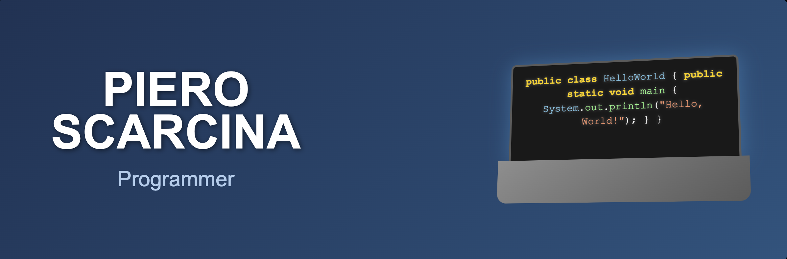

# Piero Scarcina

  

**Rome, Italy** | **Student at 42 Roma Luiss**

---

## About Me

I'm an extremely curious person with a strong scientific background. I discovered in software development a field that truly satisfies my desire to understand, improve, and learn every day. Each project is an opportunity to apply what I learn in a concrete way, with critical thinking, attention to detail, and method.

I'm passionate about how programming combines logic, precision, and creativity. I enjoy analyzing problems and finding functional, meaningful solutions that are both technically sound and practically applicable.

---

## Tech Stack

### Languages & Markup

  &nbsp;&nbsp;&nbsp;&nbsp;
  &nbsp;&nbsp;&nbsp;&nbsp;
  &nbsp;&nbsp;&nbsp;&nbsp;
  &nbsp;&nbsp;&nbsp;&nbsp;
  &nbsp;&nbsp;&nbsp;&nbsp;
  &nbsp;&nbsp;&nbsp;&nbsp;
  &nbsp;&nbsp;&nbsp;&nbsp;
  &nbsp;&nbsp;&nbsp;&nbsp;

  Java &nbsp;&nbsp;&nbsp;&nbsp; | ; C &nbsp;&nbsp;&nbsp;&nbsp; | ; JavaScript |&nbsp;&nbsp;&nbsp;&nbsp; TypeScript |&nbsp;&nbsp;&nbsp;&nbsp; HTML | &nbsp;&nbsp;&nbsp;&nbsp; CSS | &nbsp;&nbsp;&nbsp;&nbsp; PostgreSQL | &nbsp;&nbsp;&nbsp;&nbsp; Bash

### Frameworks, Tools & Platforms

  &nbsp;&nbsp;&nbsp;&nbsp;
  &nbsp;&nbsp;&nbsp;&nbsp;
  &nbsp;&nbsp;&nbsp;&nbsp;
  &nbsp;&nbsp;&nbsp;&nbsp;
  &nbsp;&nbsp;&nbsp;&nbsp;
  &nbsp;&nbsp;&nbsp;&nbsp;
  

  Spring Boot | &nbsp;&nbsp;&nbsp;&nbsp; Docker | &nbsp;&nbsp;&nbsp;&nbsp; Git | &nbsp;&nbsp;&nbsp;&nbsp; GitHub | &nbsp;&nbsp;&nbsp;&nbsp; VS Code | &nbsp;&nbsp;&nbsp;&nbsp; IntelliJ | &nbsp;&nbsp;&nbsp;&nbsp; Angular

**Additional Experience**: Maven • Postman • JDBC • Hibernate • Thymeleaf • REST APIs • Shell/Terminal

---

## GitHub Stats

---

## Current Focus

**Working on**: Expanding my Spring Boot expertise  
**Learning**: Advanced Java concepts and microservices architecture  
**Looking to collaborate on**: Open source Java projects  
**Ask me about**: Java, Spring Boot, problem-solving approaches  
**Fun fact**: I approach every coding challenge like a scientific experiment

---

## Achievements & Certifications

**42 Roma Luiss** - Intensive programming curriculum  
**Generation Italy** - Java Developer bootcamp  
**Scientific Background** - Strong analytical and methodical approach

---

## Activity Graph

---

## Contact Me

---

**"Every line of code is a step towards solving tomorrow's challenges"**

